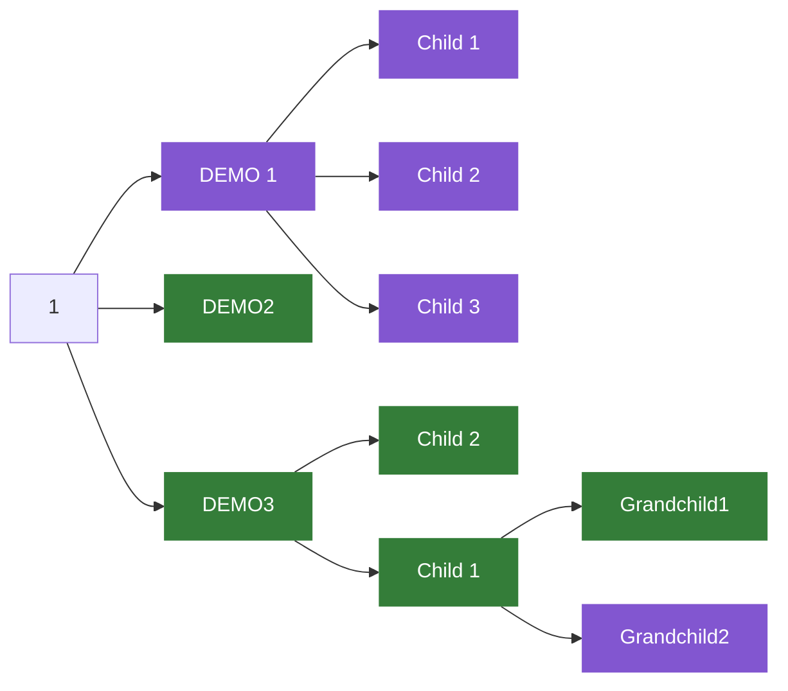

## gid (Grasp issue dependencies)

[](https://github.com/k-nasa/gid/actions)
[](https://crates.io/crates/gid_cli)
[](https://github.com/k-nasa/gid/blob/main/LICENSE)
[](https://github.com/k-nasa/gid/stargazers)

Help project managers and project owners with easy-to-understand views of github issue dependencies.


This tool can be used on github action or the command line.
Basically, it is supposed to be used in Github Action.


It relies on GitHub's builtin mermaid support. The output format may increase in the future.

Currently it only supports analysis with the [tracking feature of GitHub issues](https://docs.github.com/en/issues/tracking-your-work-with-issues/about-task-lists).
Issue Description tasks and issue link analysis will be added in the future.

## DEMO

### [GitHub Actions](https://github.com/marketplace/actions/grasp-issue-dependencies)

Adding the following workflow will analyze the issue every minute and comment on the diagram. (This is an example of parsing an issue labeled "root".)

```yml
name: Comment gid
on:
  schedule:
    - cron: '* * * * *'

jobs:
  grasp_issue:
    runs-on: macOS-latest
    name: Grasp issue dependencies
    steps:
      - uses: actions/checkout@v3
      - uses: k-nasa/gid@main
        with:
          label: 'root' # Analyze the issue with the specified label
          github_token: ${{secrets.GITHUB_TOKEN}}
```

Comment by github actions.


### CLI

Let's analyze [issue 1](https://github.com/k-nasa/gid/issues/1) as a trial.

```sh
gid -o k-nasa -r gid -i 1
```

This command outputs the following figure. (To be exact, the mermaid script that is the basis of the figure is output.)



## Usage

```sh
gid 0.1.0
k-nasa <htilcs1115@gmail.com>
Issue graphical tool

USAGE:
    gid --organization <ORGANIZATION> --repository <REPOSITORY> --issue-number <ISSUE_NUMBER>

OPTIONS:
    -h, --help                           Print help information
    -i, --issue-number <ISSUE_NUMBER>
    -o, --organization <ORGANIZATION>
    -r, --repository <REPOSITORY>
    -V, --version                        Print version information
```

## Install

curl

```sh
curl -L -o gid.tar.gz https://github.com/k-nasa/gid/releases/download/0.1.0/gid_x86_64-apple-darwin.tar.gz
tar -zxvf gid.tar.gz

# Move binary file to the path
mv gid_x86_64-apple-darwin/gid /usr/local/bin
```

cargo


```sh
cargo install gid_cli
```

## Contribution

1. Fork it (http://github.com/k-nasa/gid)
2. Create your feature branch (git checkout -b my-new-feature)
3. Commit your changes (git commit -am 'Add some feature')
4. Push to the branch (git push origin my-new-feature)
5. Create new Pull Request

## License

[MIT](https://github.com/k-nasa/gid/blob/master/LICENSE)

## Author

[k-nasa](https://github.com/k-nasa)
